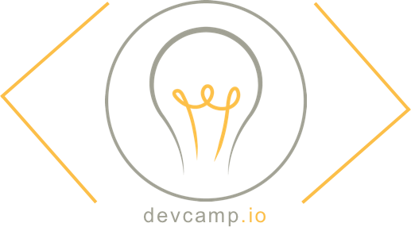

# Devcamp.io
A forum and blog software written in the MEAN Stack.

## Techologies
- **MongoDB**: MongoDB is used for storing users, threads, replies, blogs, etc. MongoDB is the obvious choice when working with Node.js

- **Mongoose**: Mongoose is a MongoDB wrapper that introduces schematics and provides helpful functions when working with the database.

- **Express**: I'm using Express for routing. If I used purely Node.js to route, this project would be much larger. Express is the natural choice when working with Node.js.

- **AngularJS**: AngularJS is being used as my front-end framework. 

- **Node.js**: This piece of technology is being used as my server. Thanks node.

- **Compass**: While I'm not going to have a lot of styling, I still prefer to work with Compass because it has support for variables and nesting.

- **AJAX**: AJAX will handle POST and GET requests to and from the server so that the page isn't reloaded every time the user makes a post.

- **D3**: A canvas/SVG framework for JavaScript for easily implementing visual representations of information. We're using it to display information about schools such as hours, attendance, costs, salary upon graduation, and time looking for a job.

- **Ionic**: A wrapper for web languages that allows them to be run as native mobile applications. We will be using Ionic to create an app for users who prefer a mobile experience.

## Concept
Coding bootcamps are becoming extremely popular. Lots of students are beginning to turn to these programs instead of college because they are cheaper and usually more immersive. This website serves as a community where students and instructors alike can have a real conversation.

The main feature of the website is the forums. Anyone can create a thread and reply to threads. When a thread gets popular, it will be featured on the Blog page. Each user has a profile that contains all of their content, whether they are a (prospective) student or instructor, and their location. Users can follow other users. 

##Contributors

Danny Arango [Github](http://www.github.com/thenew000) [Website](http://www.dannyarango.com)

Jackson Yeager [Github](http://www.github.com/volitiondevelopment) [Website](https://www.volition-dev.com)

## Screenshots

## Installation
If you'd like to spin up your own server, follow these instructions:

`git clone https://github.com/yeager-j/devcamp.io`

`cd devcamp.io`

`npm install`

`bower install`

`node bin/www`

Open your browser and connect to `http://localhost:3000`

## Live Demo

The official website is hosted here: http://devcamp.io
